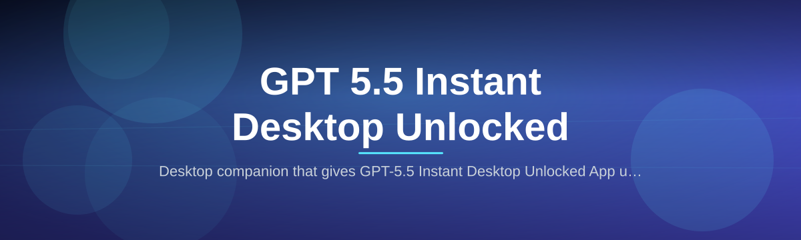
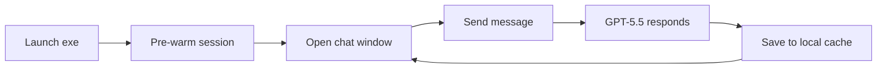

# gpt55-instant-desktop-app

  

*A clean desktop front-end for GPT-5.5 that opens instantly — for people who want chat, not another browser tab.*

## What this is NOT

Let’s get this out of the way: this is not a web-scraper, a reverse-engineered API wrapper, or a “cracked” build of anything. There are no hidden fees, no login walls, and no command-line gymnastics. The word “Unlocked” in the name refers to your workflow, not to bypassing a paywall. If you’ve been burned by shady “AI boosters” in the past, I don’t blame you for being skeptical — read on.

## What this actually does

The **GPT-5.5 Instant Desktop Unlocked App** is a lightweight Windows desktop client that docks GPT-5.5 into its own distraction-free window, starts in under two seconds, and remembers every conversation across sessions. It runs as a standalone `.exe` with no installer, no background services, and no need to keep a browser tab open. The "Instant" part is literal: you launch it, and the chat interface is ready before your mouse stops moving. The "Desktop" part means it lives in your taskbar like any normal app, so it feels like a native tool rather than another website.

This project exists because GPT-5.5 is powerful, but the browser experience gets clumsy when you switch between a dozen tabs, your work documents, and your chat window. The app gives you a persistent, always-on GPT-5.5 environment that behaves like a proper desktop application — with system tray support, global hotkeys, and a snappy UI that doesn’t feel like a webpage stuffed into a frame.

  

The button above opens the landing page where you can download the latest release — no sign-up, no email required. Just grab the file and go.

## Who this is for

- **Writers and researchers** who need GPT-5.5 open alongside their notes without losing half their screen to browser chrome.
- **Developers** who want a quick Q&A session between coding tasks without tab-switching every 30 seconds.
- **Business users** who prefer a dedicated app icon in the taskbar rather than managing another bookmark.
- **People who multitask** and want GPT-5.5 available with two keystrokes (global shortcut) from any application.
- **Privacy-conscious users** who want their conversation history stored locally in a simple text file they can back up.

## What you can do

- **Launch to a ready prompt in under 2 seconds** — the app pre-warms the session in the background, so it feels like opening Notepad, not a heavy web app.
- **Keep conversations persistent across reboots** — everything is saved automatically; you can close the app mid-thought and pick up right where you stopped.
- **Use a global hotkey (Ctrl+Shift+Space by default)** to summon the window from any application — no alt-tabbing through 12 windows to find it.
- **Resize and snap the window like a native tool** — it respects Windows snap layouts, Aero snapping, and multi-monitor setups without glitchy borders.
- **Export full chat logs as Markdown or plain text** — great for documentation, backup, or reviewing past ideas.
- **Choose between light and dark themes that follow your system setting** — no more eye-searing white pages at 2 a.m.

## Up and Running

**Visit the landing page** — head to [the official project page](https://ThornFreighter.github.io/gpt55-instant-desktop-app/) (linked in the button above) and download the latest `GPT55-Instant-Setup.exe`.

**Save it anywhere** — this is a portable app; it doesn’t need to go into `Program Files`. Put it in a folder, on your Desktop, or even on a USB stick if you want to carry it around.

**Double-click to run** — that’s it. The first launch may take a few seconds longer as it creates its local data folder, but subsequent starts are near-instant. No installation wizard, no registry changes, no UAC pop-ups.

**Pin it to your taskbar** — right-click the running app icon and select “Pin to taskbar” for quick access. Optionally, set it to start with Windows via the app’s settings menu.

**Customize the hotkey** — open Settings → Shortcuts and change the global summon key if Ctrl+Shift+Space conflicts with something you use.

## Requirements

- **Windows 10 or 11** (64-bit)
- **~200 MB free disk space** for the app and conversation storage
- **No .NET, Node.js, or Python required** — the executable is self-contained
- **Internet connection** — the app is a front-end for GPT-5.5, so you’ll need to be online to chat
- **A screen resolution of 1024×768 or higher** (basically any modern display)

## How it works

1. The app loads the GPT-5.5 interface into a lightweight native window that strips away browser menu bars, extensions, and background tabs.
2. It maintains a secure local session cache so your conversation history persists and restores instantly.
3. A small background helper process runs only while the app is open, enabling the global hotkey and system tray features.
4. All your chat data is stored in a plain-text JSON file inside the app’s folder — you can back it up, move it, or delete it at will.

Here is a simplified flow:

## FAQ

**Does this app require its own GPT-5.5 API key?**  
No, it works with your existing GPT-5.5 account. You log in through the app’s built-in browser window once, and it remembers your session securely.

**Is “Unlocked” in the name mean it bypasses subscription limits?**  
No. “Unlocked” refers to liberating the chat from your web browser. It does not alter, trick, or modify GPT-5.5’s own access rules or subscription tiers. You see exactly what your account is entitled to.

**Will this run on Windows 10 or only 11?**  
Both. It was tested on Windows 10 (22H2) and Windows 11 (23H2/24H2). If you’re on an older build, you might run into graphics quirks, but the core function should work.

**How is this different from just opening the browser and bookmarking the site?**  
Performance and persistence. The app uses a dedicated rendering engine that skips loading browser extensions and background tabs, making it noticeably snappier. It also adds desktop features like the global hotkey, tray minimisation, and local exporting — things a browser tab simply can’t do.

**I’m worried about privacy with a third-party desktop app.**  
The app does not phone home anywhere except to the official GPT-5.5 service you’re using. Your chat history stays in the local JSON file on your machine; there’s no telemetry, no analytics, and no tracker. The source code is MIT-licensed, so you can read exactly what it does.

## Troubleshooting

**The window opens but shows a blank white screen**  
This usually means the local session cache is corrupted. Close the app, delete the `session_data` folder in the app directory, and relaunch. You’ll need to log in again, but your old text exports (if any) are still in the `exports` folder.

**The global hotkey doesn’t work**  
Check if another application is already using Ctrl+Shift+Space. If so, open the app’s Settings → Shortcuts and assign a different combination. Also verify the app is running (it must be in the tray, not fully closed).

**Chat history isn’t saving between restarts**  
Make sure the app has write permission to its own folder. If you placed the `.exe` in a protected directory like `C:\Program Files`, move it to a normal folder like `C:\Users\YourName\Apps`.

**The font or text looks tiny on a high-DPI display**  
This is a known quirk with some scaling settings. Right-click the running app in the taskbar → Properties → Compatibility → “Change high DPI settings” → check “Override high DPI scaling behavior” and set it to “Application.”

## License

This project is released under the [MIT License](LICENSE) — you are free to use, modify, and distribute it, provided you keep the original copyright notice. This app is an independent front-end and is not affiliated with or endorsed by OpenAI. “GPT” and “GPT-5.5” are trademarks of their respective owners; this is a community-made tool for personal workflow improvement.

  

